D5.2 – Uncertainty-aware Visual Analytic Components
================

  - [Load the data](#load-the-data)
  - [Select the most similar
    experiments](#select-the-most-similar-experiments)
  - [Bayesian Model](#bayesian-model)
  - [Uncertainty Visualizations](#uncertainty-visualizations)
      - [Spaghetti](#spaghetti)
      - [Uncertainty bands](#uncertainty-bands)
      - [Gradient](#gradient)
      - [Hypothetical Outcome Plots
        (HOPs)](#hypothetical-outcome-plots-hops)
  - [Session Info](#session-info)

## Load the data

Load the **current experiment** and the **past experiments**.

``` r
current_experiment <-
  read_csv(here::here("data", "interim", "running_experiment.csv")) %>%
  mutate(elapsedtime = hms(elapsedtime_s))
past_experiments <-
  read_csv(here::here("data", "interim", "past_experiments.csv")) %>%
  mutate(elapsedtime = hms(elapsedtime_s))
```

## Select the most similar experiments

Look for the fermentation experiments that have a smaller mean absolute
error with our **experiment** until our **running\_time**.

``` r
RULE <- "1:00:00" %>% as.hms() %>% as.numeric()
PCT_SELECTION <- .1

running_time <- max(current_experiment$elapsedtime)
experiment <- current_experiment$code_experimentation[1]

experiments_smooth <-
  past_experiments %>%
  filter(elapsedtime <= running_time) %>%
  bind_rows(current_experiment) %>%
  as_tsibble(
    index = elapsedtime,
    key = id(code_experimentation),
  ) %>%
  group_by(code_experimentation) %>%
  index_by(time = trunc_hms(elapsedtime, RULE)) %>%
  summarise(debitCO2_g = mean(debitCO2_g)) %>%
  fill_gaps(.full = TRUE) %>%
  mutate(debitCO2_g = na.approx(debitCO2_g, na.rm = FALSE, rule = 2)) %>%
  as_tibble()

experiments_error <- experiments_smooth %>%
  spread(code_experimentation, debitCO2_g) %>%
  select(-time) %>%
  mutate_all(`-`, .[[experiment]]) %>%
  mutate_all(abs) %>%
  summarise_all(mean) %>%
  gather(code_experimentation, MAE) %>%
  arrange(MAE) %>%
  filter(code_experimentation != experiment) %>%
  filter(MAE < quantile(MAE, PCT_SELECTION))


selected_experiments <- experiments_error %>% pull(code_experimentation)
```

Plot the selected experiments (the 10% with smaller error).

``` r
experiments_smooth %>%
  mutate(exeriments = ifelse(code_experimentation %in% selected_experiments, "selected", "non selected")) %>%
  mutate(exeriments = ifelse(code_experimentation == experiment, "running experiment", exeriments)) %>%
  ggplot(aes(time, debitCO2_g)) +
  geom_line(aes(group = code_experimentation, color = exeriments, alpha = exeriments)) +
  scale_color_manual(values = c("grey", "navy", "skyblue")) +
  scale_alpha_manual(values = c(0.3, 1, 0.7)) +
  labs(x = "Elapsed Time", y = "debitCO2 (g)")
```

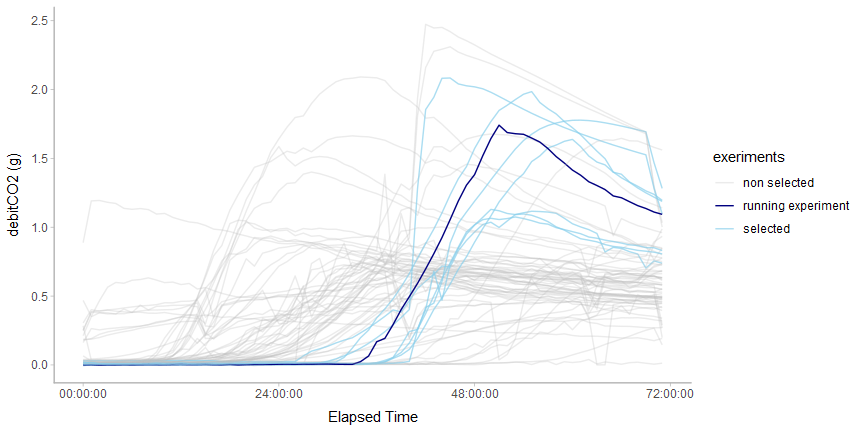<!-- -->

## Bayesian Model

Smooth the past experiments by calculating the mean over each hour.

``` r
RULE_OBS <- "1:00:00" %>% as.hms() %>% as.numeric()

obs <- past_experiments %>%
  filter(code_experimentation %in% selected_experiments) %>%
  rename(elapsedtime_reading = elapsedtime) %>%
  as_tsibble(
    index = elapsedtime_reading,
    key = id(code_experimentation),
  ) %>%
  group_by(code_experimentation) %>%
  index_by(elapsedtime = trunc_hms(elapsedtime_reading, RULE_OBS)) %>%
  summarise(debitCO2_g = mean(debitCO2_g)) %>%
  as_tibble() %>%
  filter(elapsedtime <= quantile(elapsedtime, .9)) %>%
  arrange(elapsedtime)
```

Calculate the data needed by the model, compile the .stan file and
sample from it (or load if already sampled).

``` r
X <- obs$elapsedtime
Y <- obs$debitCO2_g
num_data <- length(X)

num_knots <- 15
knot_list <- quantile(obs$elapsedtime, probs = seq(0, 1, length.out = num_knots))
B <- bs(obs$elapsedtime,
  knots = knot_list[-c(1, num_knots)],
  degree = 3, intercept = TRUE
)
num_basis <- ncol(B)

data <- list(X = X, Y = Y, num_data = num_data, num_basis = num_basis)
model_file <- glue("m_{experiment}_{running_time}s.rds")

if (file.exists(here::here("data", "interim", model_file))) {
  fit <- readRDS(here("data", "interim", model_file))
} else {
  sm <- stan_model(here::here("src", "models", "fermentation.stan"))
  fit <- sampling(sm, data = data, iter = 500, control = list(adapt_delta = 0.95))
  saveRDS(fit, here::here("data", "interim", model_file))
}
```

    ## Warning: There were 19 divergent transitions after warmup. Increasing adapt_delta above 0.95 may help. See
    ## http://mc-stan.org/misc/warnings.html#divergent-transitions-after-warmup

    ## Warning: Examine the pairs() plot to diagnose sampling problems

Draw predictions from the model samples.

``` r
num_points <- 100
elapsedtime_quantiles <- quantile(obs$elapsedtime, probs = seq(0, 1, length.out = num_points - 1)) %>% unname()
elapsedtime_seq <- sort(c(as.hms(running_time), elapsedtime_quantiles))

new_B <- bs(elapsedtime_seq,
  knots = knot_list[-c(1, num_knots)],
  degree = 3, intercept = TRUE
)

post_samples <- fit %>%
  spread_draws(w[bi], w_sigma[bi]) %>%
  group_by(.chain, .iteration, .draw) %>%
  do(.value = new_B %*% as.vector(t(.$w)), sigma = new_B %*% as.vector(t(.$w_sigma))) %>%
  mutate(elapsedtime = list(elapsedtime_seq)) %>%
  unnest() %>%
  mutate(.prediction = rnorm(n(), .value, sigma)) %>%
  select(.draw, elapsedtime, .prediction, .value, )

post_samples_with_last_obs <-
  current_experiment %>%
  slice(n()) %>%
  mutate(.draw = list(1:max(post_samples$.draw))) %>%
  unnest() %>%
  mutate(.prediction = debitCO2_g, .value = debitCO2_g) %>%
  select(.draw, elapsedtime, .prediction, .value, ) %>%
  bind_rows(post_samples %>% filter(elapsedtime > running_time)) %>%
  filter(elapsedtime >= running_time) %>%
  arrange(.draw, elapsedtime)
```

## Uncertainty Visualizations

``` r
labs <- labs(
  title = glue("Fermentation of Experiment {experiment} ({as.hms(running_time)})"),
  x = "Elapsed Time", y = "debitCO2 (g)"
)
```

### Spaghetti

``` r
time_limit <- elapsedtime_seq[match(TRUE, elapsedtime_seq >= running_time)]

prediction_color <- "#3573b9"
past_color <- "gray1"
num_samples <- 100
samples <- post_samples %>% sample_draws(num_samples)

spaghetti_plot <-
  current_experiment %>%
  ggplot(aes(x = elapsedtime, y = debitCO2_g)) +
  geom_line(aes(y = .prediction, group = .draw),
    color = prediction_color, alpha = 1 / 20, size = .75,
    data = samples %>% filter(elapsedtime >= time_limit)
  ) +
  geom_line(aes(y = .prediction, group = .draw),
    color = past_color, alpha = 1 / 40, size = .75,
    data = samples %>% filter(elapsedtime <= time_limit)
  ) +
  geom_line(size = 1.25, color = "gray20") +
  labs

spaghetti_plot
```

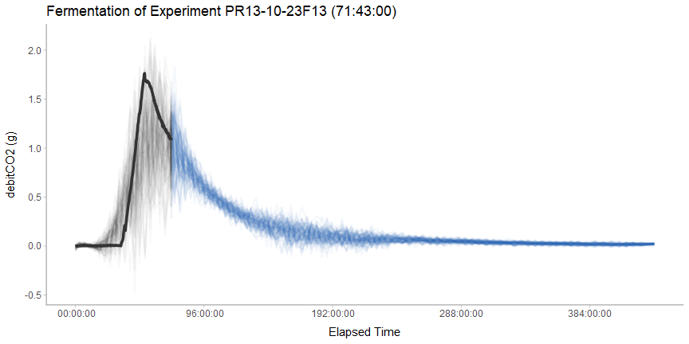<!-- -->

Load and show the real evolution of the experiment fermentation.

``` r
experiment_future <-
  read_csv(here::here("data", "interim", "experiment_future.csv")) %>%
  mutate(elapsedtime = hms(elapsedtime_s))

future_line <- geom_line(size = 1.25, color = "#ff7f0e", data = experiment_future)

spaghetti_plot + future_line
```

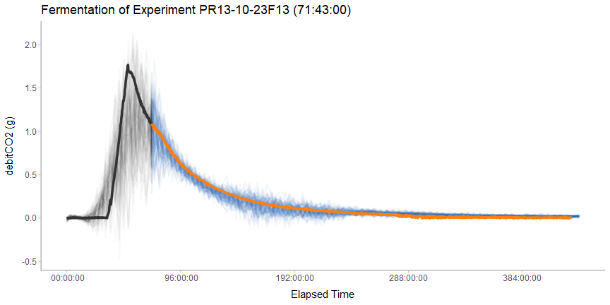<!-- -->

### Uncertainty bands

``` r
current_experiment %>%
  ggplot(aes(x = elapsedtime, y = debitCO2_g)) +
  stat_lineribbon(aes(y = .prediction),
    fill = adjustcolor(prediction_color, alpha.f = .2), color = prediction_color,
    data = post_samples %>% filter(elapsedtime >= time_limit), .width = .95
  ) +
  stat_lineribbon(aes(y = .prediction),
    fill = adjustcolor(past_color, alpha.f = .2), color = NA,
    data = post_samples %>% filter(elapsedtime <= time_limit), .width = .95
  ) +
  geom_line(size = 1.25, color = "gray20") +
  labs
```

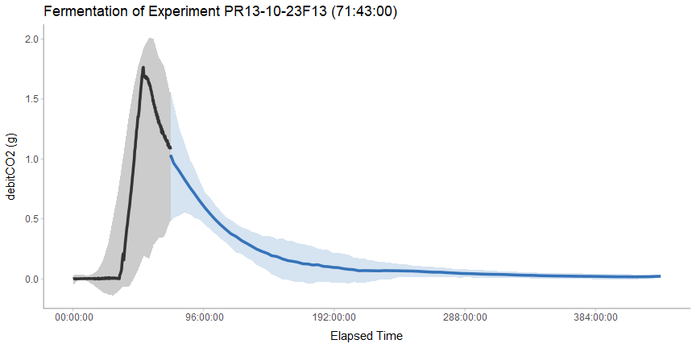<!-- -->

``` r
bands_plot <-
  current_experiment %>%
  ggplot(aes(x = elapsedtime, y = debitCO2_g)) +
  stat_lineribbon(aes(y = .prediction),
    fill = prediction_color, alpha = 1 / 5,
    data = post_samples %>% filter(elapsedtime >= time_limit)
  ) +
  stat_lineribbon(aes(y = .prediction),
    fill = past_color, color = NA, alpha = 1 / 5,
    data = post_samples %>% filter(elapsedtime <= time_limit)
  ) +
  geom_line(size = 1.25, color = "gray20") +
  labs

bands_plot
```

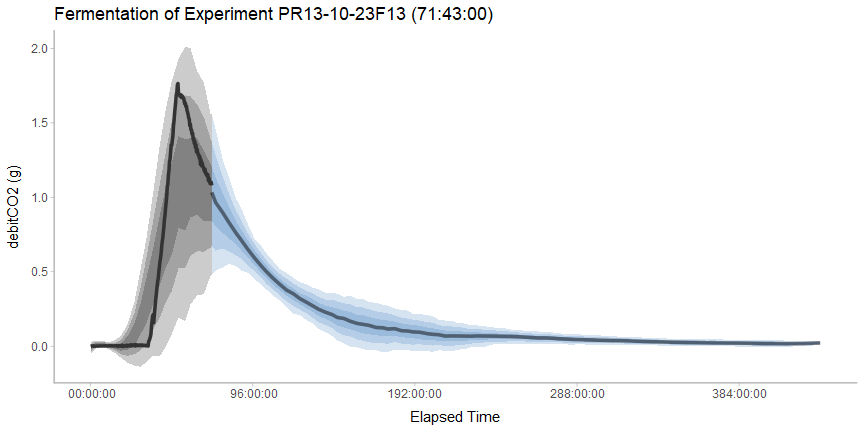<!-- -->

``` r
bands_plot + future_line
```

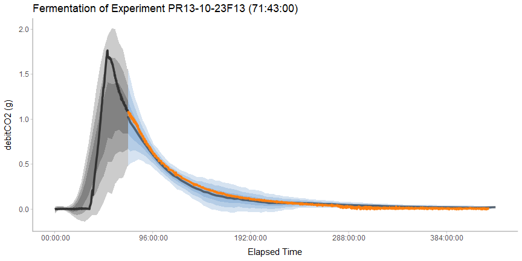<!-- -->

### Gradient

``` r
n_bands <- 40

gradient_plot <-
  current_experiment %>%
  ggplot(aes(x = elapsedtime, y = debitCO2_g)) +
  stat_lineribbon(aes(y = .prediction),
    fill = prediction_color, color = NA, alpha = 1 / n_bands, .width = ppoints(n_bands),
    data = post_samples %>% filter(elapsedtime >= time_limit)
  ) +
  stat_lineribbon(aes(y = .prediction),
    fill = past_color, color = NA, alpha = 1 / n_bands, .width = ppoints(n_bands),
    data = post_samples %>% filter(elapsedtime <= time_limit)
  ) +
  geom_line(size = 1.25, color = "gray20") +
  labs


gradient_plot
```

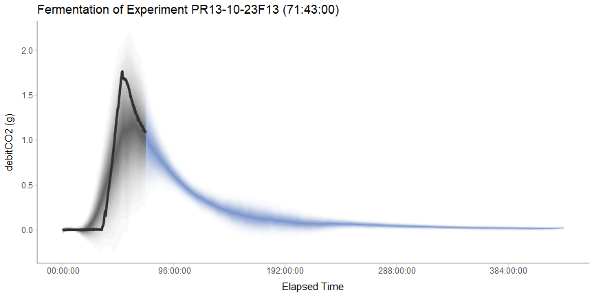<!-- -->

``` r
gradient_plot + future_line
```

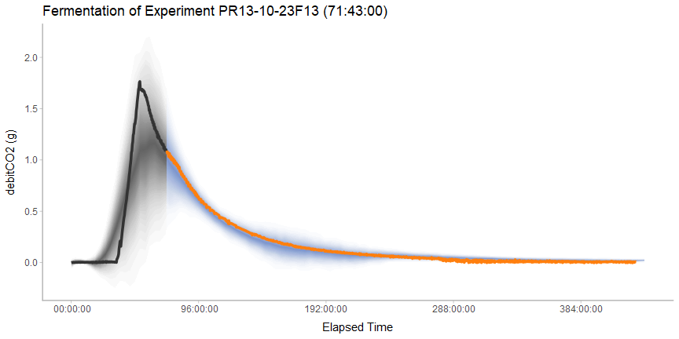<!-- -->

### Hypothetical Outcome Plots (HOPs)

``` r
samples_hop <- post_samples_with_last_obs %>% filter(elapsedtime >= running_time) %>% sample_draws(num_samples)

hop <- current_experiment %>%
  ggplot(aes(x = elapsedtime, y = debitCO2_g)) +
  geom_line(aes(y = .prediction, group = .draw),
    color = prediction_color, size = .75,
    data = samples_hop
  ) +
  geom_line(size = 1.25, color = "gray20") +
  labs +
  transition_states(.draw, 0, 1)

animate(hop,
  nframes = num_samples, fps = 2.5, res = 100,
  width = 900, height = 450, type = "cairo"
)
```

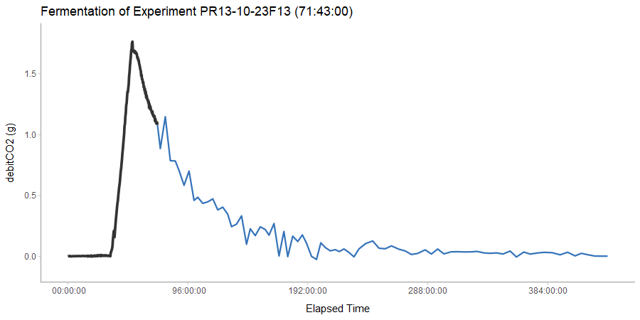<!-- -->

``` r
hop_spaghetti <- hop +
  shadow_mark(past = TRUE, future = TRUE, color = "gray1", alpha = 1 / 40)

animate(hop_spaghetti,
  nframes = num_samples, fps = 2.5, res = 100,
  width = 900, height = 450, type = "cairo"
)
```

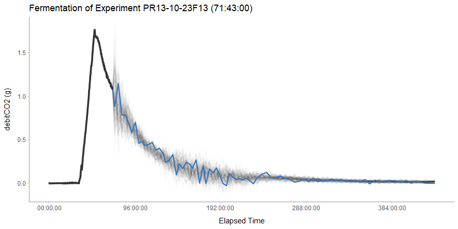<!-- -->

``` r
hop$layers <- c(future_line, hop$layers)

animate(hop,
  nframes = num_samples, fps = 2.5, res = 100,
  width = 900, height = 450, type = "cairo"
)
```

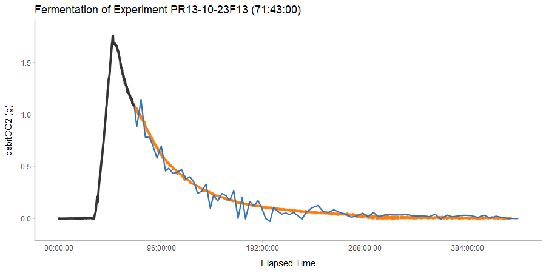<!-- -->

## Session Info

    ## R version 3.6.0 (2019-04-26)
    ## Platform: x86_64-w64-mingw32/x64 (64-bit)
    ## Running under: Windows 10 x64 (build 17134)
    ## 
    ## Matrix products: default
    ## 
    ## locale:
    ## [1] LC_COLLATE=English_United States.1252 
    ## [2] LC_CTYPE=English_United States.1252   
    ## [3] LC_MONETARY=English_United States.1252
    ## [4] LC_NUMERIC=C                          
    ## [5] LC_TIME=English_United States.1252    
    ## 
    ## attached base packages:
    ## [1] splines   stats     graphics  grDevices utils     datasets  methods  
    ## [8] base     
    ## 
    ## other attached packages:
    ##  [1] zoo_1.8-5          hms_0.4.2          tsibble_0.7.0     
    ##  [4] glue_1.3.1         gganimate_1.0.3    tidybayes_1.0.4   
    ##  [7] modelr_0.1.4       rstan_2.18.2       StanHeaders_2.18.1
    ## [10] here_0.1           magrittr_1.5       forcats_0.4.0     
    ## [13] stringr_1.4.0      dplyr_0.8.0.1      purrr_0.3.2       
    ## [16] readr_1.3.1        tidyr_0.8.3        tibble_2.1.1      
    ## [19] ggplot2_3.1.1      tidyverse_1.2.1    pacman_0.5.1      
    ## 
    ## loaded via a namespace (and not attached):
    ##  [1] nlme_3.1-139              matrixStats_0.54.0       
    ##  [3] sf_0.7-4                  lubridate_1.7.4          
    ##  [5] progress_1.2.0            httr_1.4.0               
    ##  [7] rprojroot_1.3-2           tools_3.6.0              
    ##  [9] backports_1.1.4           R6_2.4.0                 
    ## [11] KernSmooth_2.23-15        DBI_1.0.0                
    ## [13] lazyeval_0.2.2            colorspace_1.4-1         
    ## [15] withr_2.1.2               tidyselect_0.2.5         
    ## [17] gridExtra_2.3             prettyunits_1.0.2        
    ## [19] processx_3.3.0            compiler_3.6.0           
    ## [21] cli_1.1.0                 rvest_0.3.3              
    ## [23] arrayhelpers_1.0-20160527 xml2_1.2.0               
    ## [25] labeling_0.3              scales_1.0.0             
    ## [27] classInt_0.3-3            callr_3.2.0              
    ## [29] digest_0.6.18             rmarkdown_1.12           
    ## [31] pkgconfig_2.0.2           htmltools_0.3.6          
    ## [33] rlang_0.3.4               readxl_1.3.1             
    ## [35] rstudioapi_0.10           farver_1.1.0             
    ## [37] generics_0.0.2            svUnit_0.7-12            
    ## [39] jsonlite_1.6              inline_0.3.15            
    ## [41] loo_2.1.0                 Rcpp_1.0.1               
    ## [43] munsell_0.5.0             stringi_1.4.3            
    ## [45] yaml_2.2.0                pkgbuild_1.0.3           
    ## [47] plyr_1.8.4                ggstance_0.3.1           
    ## [49] grid_3.6.0                parallel_3.6.0           
    ## [51] crayon_1.3.4              lattice_0.20-38          
    ## [53] haven_2.1.0               transformr_0.1.1         
    ## [55] knitr_1.22                ps_1.3.0                 
    ## [57] pillar_1.3.1              codetools_0.2-16         
    ## [59] lpSolve_5.6.13            stats4_3.6.0             
    ## [61] evaluate_0.13             gifski_0.8.6             
    ## [63] png_0.1-7                 tweenr_1.0.1             
    ## [65] cellranger_1.1.0          gtable_0.3.0             
    ## [67] assertthat_0.2.1          xfun_0.6                 
    ## [69] broom_0.5.2               e1071_1.7-1              
    ## [71] coda_0.19-2               class_7.3-15             
    ## [73] viridisLite_0.3.0         units_0.6-2
